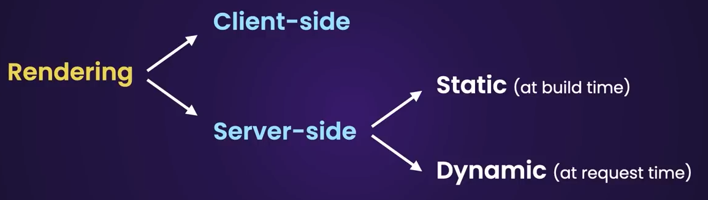

Node js help us to create component which are rendered at server side.

[ Pros ]

- Smaller Bundles
- Resource Efficinet
- SEO
- More Secure

[ Cons - Server Component Cannot use below things ]

- Listen to browser events
- Acces browser APIs
- Maintain State
- Use effects

`Conclusion` : in realworl we often use mixture of server and client components , we should default to server components and use client compoent only we absolutely need them.

`app-directory :` all components by default in this folder is server component.So will rendered on the server only.

'`use client` -> add this first line of file :  to make this client compoent now we can add onClick event to button and all the compoents this compoent depends upon will automatically becomes client component, so now this won't be pass as rendered html page , it will pass as js file in bundle.

`To get fake data : ` https://jsonplaceholder.typicode.com/

`API-Calls` : In react we have to use usestate()+useeffect() for fetching data and maitaing the state and this is done on client side which is very slow, we can do it directly in next-js and also on server only (which do not exposes our api to client which makes our website more secure).

`Data-Souce` : Memory(fastest) , File System (Slower) , Network(Slowest).To help in that we can use cacheing.So whenever we fetch data using fetch function next-js will automatically store those data in cache (which is based on file system , means those caches will be stored in files.)So next time when we go for fetching data from same url , then next js will fetch those data from cache.(ofcourse we have full control over that cache behaviour). `To disable cache` : fetch(url, {cache: 'no-store'}) for that url chache will be disabled.

`To Revalidate Cache` : fetch( url, {next :  { revalidate : 10}}) this will make cache to revalidate this data every 10 sec ( means refresh it.)



`Tailwind-UI-Library` : https://daisyui.com/components/

`Shared-cdn` : https://ui.shadcn.com/

`Next UI` : https://nextui.org/

# Routing

- `Static` : this type of routing does not accept any parameters they just define folder name and page file in it.
- `Dynamic` : this accepts the parameters inside it remember how we define routing for users and [id] in it.
- `Generic` : This is my term it's basically universal king of routing , remember how we defined the [[...slug]] one. See name can be any but it's conventions so we are using it.

# Link vs `<a>`

`note`: Never use  `<a>` tag for links use `<Link>` provided by nextjs so that for each request it should not download all the files on require file for that page.

- Link will only downloads the content of the target page.
- It Pre-fetches links that are in the viewport.(to see in action start app in prodution)
- As we navigate between pages Link will cache pages on the client.So next time we visit the same page next js won't do any request will pull out page from client cache.And this client cache only exist for one session and clear when we do full page reload(refresh button in web-browser).

# Rendering

- `Client-Side` : This is like react works where html file is created(rendered) in the client side all the api call everyting done on client side , which leads to the round trip to server (like bust the bundle of scripts and then for api calls) which makes it very slow.
- `Server-Side Rendering` : In this files are renderd at server side (html will be created on server side it self which makes it very fast and secure because all api request will be made before client get's the pages.)
- `Hybrid -Rendering` : In this some compoent are rendered on server side and some on client ( as mentioned above server side render pages have some limitation on interactivity for that we put the interactive part such a way that will render on client side , Remember how we created the add to cart button on start.)

## Passing Data From URL

### ` Note :  We can only pass the data from url to server in page file only for that particular url (rember how we implemented sorting by name and email.)`

# Special Files

`page.tsx` : to define the route (only this is publically accessible in form of url.)

`layout.tsx` : defining common layout for pages.

`loading.tsx` : for showing loading UI's

`route.tsx` : for creating api's

`not-found.tsx` : for showing custom errors

`error.tsx'` : for showing general custom error page.

`Note` : any file that we are creating can have extension : .js, .jsx, or tsx

#### Layout.tsx

- This is file where we define the common layout for our pages , now this follows like, the one inside app (direct child) will apply to all the page files.

`Note` By default everything will be unstyled in when using tailwind, remember how h1 were acting like the normal one.

# Programatic Navigation

- if we want to navigate to page click on button (like submit a form) use below code.

  ```
  import { useRouter } from "next/navigation";

  const NewUserPage = () => {
    const router = useRouter();
    return (
      <button
        className="btn btn-primary"
        onClick={() => router.push('/users')}>Create</button>
    )
  }
  ```

# Suspence  `loading.txs`

- This is fallback UI that we show to user , while our page is loading.
- `How it works` : First server will send the html having suspence , but wait there request response cycle won't end here(which generally do in normal pages) , server will keep it open until it will send the main content which user was waiting(in our example table) and this process is called streaming (same as video and audio streaming).
- `ways to implement it` : 1. Wrap component around the suspence component. 2. Define the loading file. (in both creating loading file is better.)

# Handling Route-Which Does not exist `not-found.tsx`

- How to handle case when user goes to page that does not exist.
- `not-found.tsx: ` just create this file and define the components you want to show.
- once you define above `tsx` file then want to programitically show it call `notFound()`
- `notFound()` : will try to runder that not-found file which is closer to route.

# Handling UnExpected Error Occur in our Program `error.tsx`

- Define `error.tsx` file which will show the custom page in case of error and it must have `use client` .
- It is same as not-found.tsx just like it we can define for all routes and closest will be called.
- and it will not detect error if occurs in `root-layout` file layout.tsx which is in app.For detecting error for this we have to define file `global-error.tsx`
- If some error occur in our produciton app it;s good to log somether eg `senerty website` so we can see what happend, now sometime we want to give users to retry in that case use parameter `reset` in propos and provide button to call it.Don't use retry techinque generally other wise it will bolt our error log just in certain part of our application.
- We simulated error my breacking the url endpoint of `json-place-holder`.

# 
    Creating APIs

Will be creating APIs for

- Getting Objects
- Creating Objects
- Updating Objects
- Deleting Objects
- Validating requests with Zod

`Note` : every folder can have any of thes files `page` or `route` file , if we want to handle markup request then use `page` file but if we want to handle use `route` file.

Few HTTP methods

- GET : getting data
- POST: creating data
- PUT: updating data ( technically to replace full entry / but use `patch` for just updating property of entry)
- For more : `https://developer.mozilla.org/en-US/docs/Web/HTTP/Methods`
- About secionts of HTTP request : `https://www.ibm.com/docs/en/cics-ts/5.3?topic=protocol-http-requests`
- We used validaiton library ZOD : `https://zod.dev/ `(npm i zod) please read the doc of it for more information.

`note` Please refer file in dir : `app/admin/route.tsx`  and `app/admin/[id]/route.tsx` to see the implementation of the apis.

`note` : serach few status code like , 200,201,400,404


# 
    Database Integration with Prisma

- `what is it` : This is ORM library for databases.

### Steps to configure database


- Download sql community version
- Download jetbrains dataGrip to see our database.
- npm i prisma
- npx prisma init : to initialize prisma in our project( this time it will ask for the database name .)
- change connection string according to database you are using in .env file and also add that file in .gitignore.
- Define your model(eg.User : name will always start wil first letter capital.) in the `schema.prisma` file .
- To format the code we define in our above file type : `npx prisma format`
- `how to define more complex models` : `https://prisma.io/docs/concepts/components/prisma-schema/data-model`
- So as we define or change our model we have to create migrations this will help to database schema to be in sync with prisma schema. `npx prisma migrate dev`  for mong : `npx prisma db push`
- Go to datagrip : connect to my sql (by providing creds and database name) and below click on test-connection to validate whether everything is okay or not.
- To work with our database first we have to create a prisma client, go in prisma folder and add file `client.ts` . Best practices to instantiate prisma client `https://www.prisma.io/docs/guides/other/troubleshooting-orm/help-articles/nextjs-prisma-client-dev-practices`

##### Important commands 

```
# Setting up prisma
npx prisma init

#Formatting Prisma schema file so it look good in tabulor form
npx prisma format

#creating and running a migration
npx prisma migrate dev

#Quick Fix : When I created the product model it was sync with database as soon as migration but scripts does not recognized it for that I have used this command before that I have stopped the server:
	npx prisma generate 
	npx prisma db push 

```
